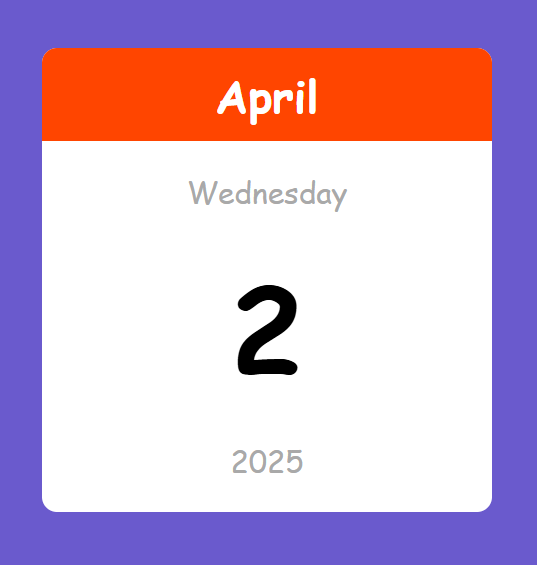

## 📅 Mini Calendar  

A **Mini Calendar** built using HTML, CSS, and JavaScript. This simple and elegant calendar displays the current date, month, and year, making it a perfect addition to any web project.  

## 🚀 Features  
- ✅ Displays the **current date, month, and year**  
- ✅ Updates automatically every day  
- ✅ Clean and responsive design  
- ✅ Lightweight and fast  

## 🛠 Tech Stack  
HTML, CSS, JavaScript  

## 📷 Screenshots  
  

## 📌 How It Works  
1. The calendar automatically fetches and displays the **current date**.  
2. Updates dynamically each day to always show accurate information.  
3. Responsive design ensures it looks great on all devices.  

## 📥 Download & Installation  
Clone the repository using Git:  
```bash
git clone https://github.com/aklema094/Mini-Calendar.git
```  
Or download the ZIP file manually from [here](https://github.com/aklema094/Mini-Calendar/archive/refs/heads/main.zip).  
